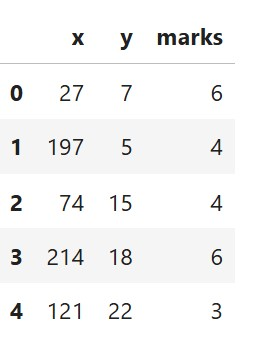
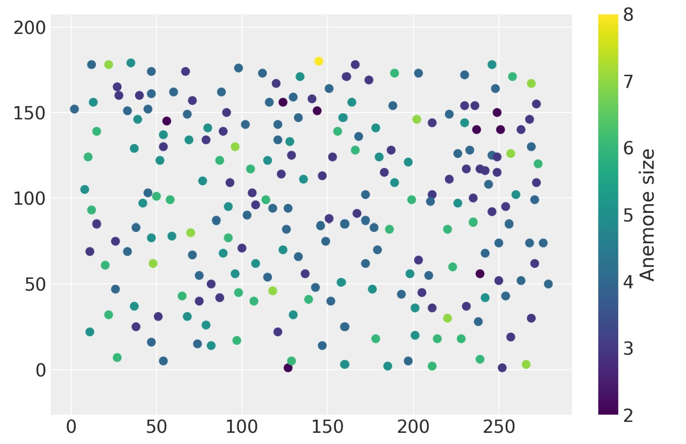
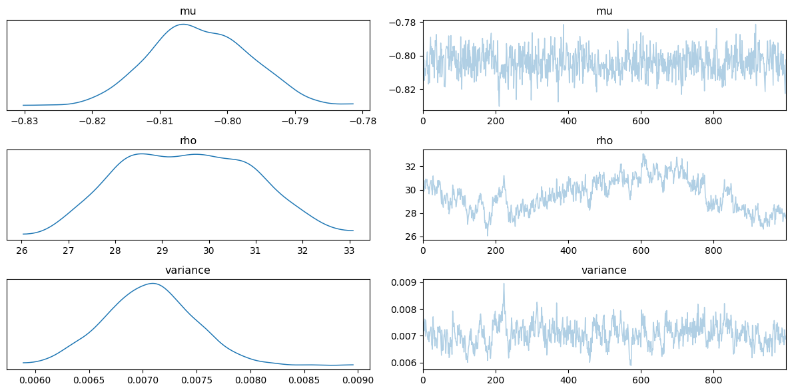
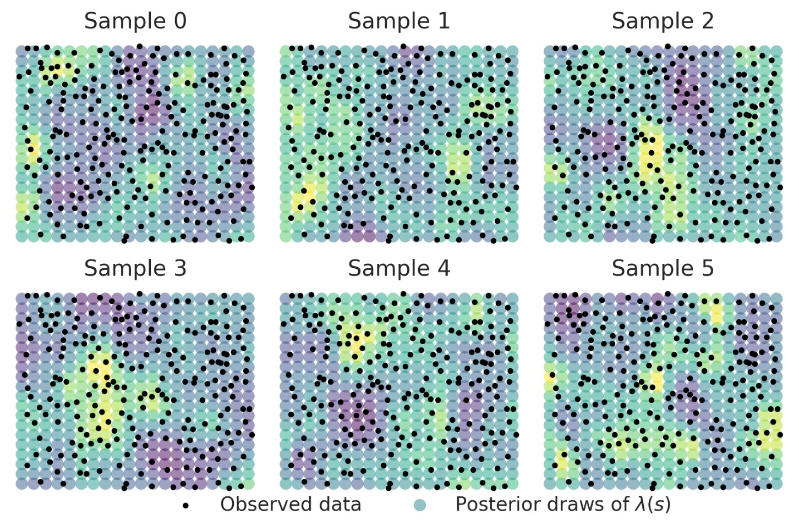
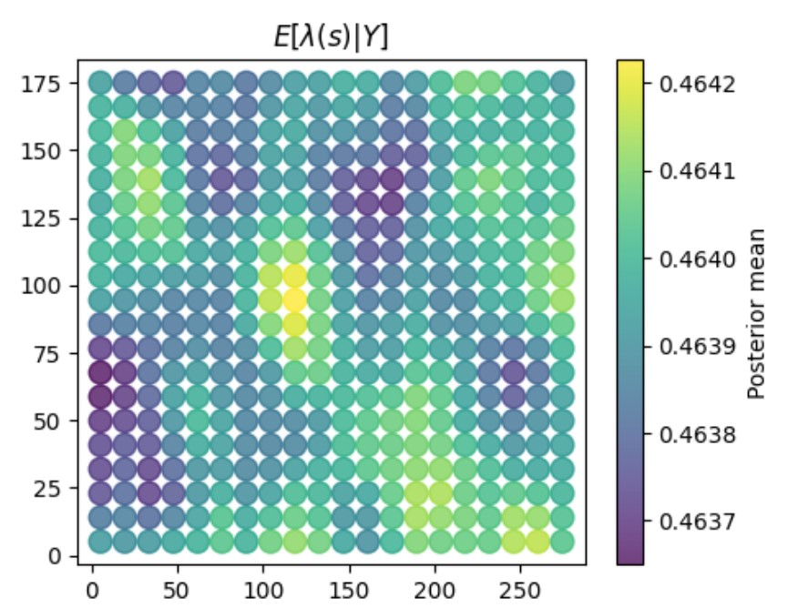
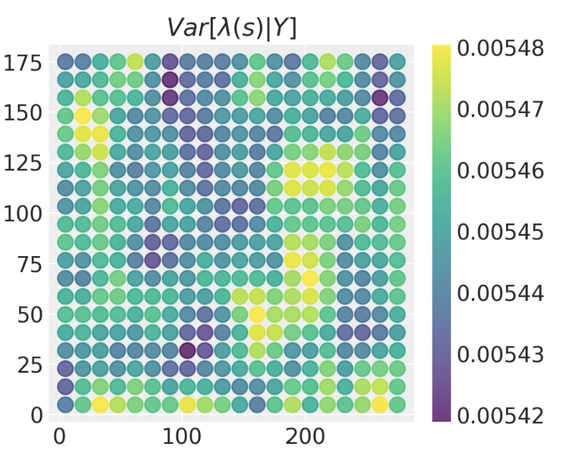

# Modeling-Log-Gaussian-Cox-Process-Numpyro

This repository contains an implementation of a Log Gaussian Cox Process (LGCP) model for analyzing spatial data. The project uses Python libraries such as JAX, NumPyro, and ArviZ for probabilistic modeling, with data preprocessing and visualization handled by Pandas and Matplotlib.

## Log-Gaussian Cox Process (LGCP)

The **Log-Gaussian Cox Process (LGCP)** models the intensity of a spatial point process as:

$
\Lambda(s) = \exp(Z(s)),
$

where:

- $\Lambda(s)$ : Intensity function at location $s$.
- $Z(s) \sim \mathcal{GP}(\mu(s), k(s, s'))$: A Gaussian process with mean function $\mu(s)$ and covariance function  $k(s, s')$.

The observed point process is modeled as a Poisson process with intensity $\Lambda(s)$.

The likelihood for $ N $ observed points $ \{s_1, s_2, \ldots, s_N\} $ is given by:

$
p(\{s_i\}_{i=1}^N \mid Z(s)) = \prod_{i=1}^N \Lambda(s_i) \exp\left(-\int_\mathcal{S} \Lambda(s) \, ds\right),
$

where $\mathcal{S} $ is the spatial domain of interest.

## Installation
Clone this repository and ensure you have Python installed along with the required libraries. Install dependencies using:

```bash
pip install jax numpy matplotlib pandas numpyro arviz

```
## Workflow
**Importing Packages**

Key libraries include:

- JAX: For numerical computations and efficient kernel operations.
- NumPyro: For probabilistic modeling and Bayesian inference.
- Matplotlib and Pandas: For visualization and data manipulation.
- ArviZ: For posterior analysis and diagnostic plots.

## Data Loading and Preprocessing
The data consists of spatial coordinates and "marks" associated with each point. The coordinates are slightly jittered to prevent alignment with grid boundaries.
```python
data = pd.read_csv('data/anemones.csv')
data.head()
```


The spatial domain is divided into grid cells with resolutions suitable for the study. Cell counts (anemone counts per grid cell) are computed.

## Visualizing Data
A scatter plot visualizes spatial distributions, with colors representing anemone sizes. Grid lines and counts per cell are overlaid.
```python
plt.scatter(data["x"], data["y"], c=data["marks"])
plt.colorbar(label="Anemone size")
plt.axis("equal");
```


## Model Development
**Matérn-5/2 Kernel**

Defines the covariance structure between spatial points.
```python
def matern52_kernel(x1, x2, sigma=1.0, lengthscale=1.0):
    ...

# compile the kernel function for better performance
matern52_kernel = jit(matern52_kernel)
```

## LGCP Model
Defines the hierarchical model structure with priors for mean intensity (mu), length scale (rho), and variance.
```python
# defining the LGCP model in Numpyro:
def lgcp_model(x = centroids):
    # Prior for mean
    mu = sample("mu", dist.Normal(0, 3))
    # Prior for length scale
    rho = sample("rho", dist.Uniform(25, 300))
    # Prior for variance using InverseGamma directly
    variance = sample("variance", dist.InverseGamma(1.0, 1.0))
    # creating covariance function:
    kernel = matern52_kernel(x, x, sigma=2, lengthscale=rho)
    cov_func = variance * kernel
    mean_func = constant_mean_function(mu)

    mean = mean_func(x)

    log_intensity = sample("log_intensity", 
                           dist.MultivariateNormal(
                               loc=mean, covariance_matrix=cov_func
                               ))
    
    # Intensity and Poisson likelihood
    intensity = jnp.exp(log_intensity)
    rates = intensity * area_per_cell

    with numpyro.plate("observations", len(cell_counts)):
        sample("counts", 
               dist.Poisson(rates), 
               obs=cell_counts)
```

## Inference
**MCMC Sampling**

Bayesian inference is conducted using the No-U-Turn Sampler (NUTS).
```python
# MCMC sampling
kernel = NUTS(lgcp_model)
mcmc = MCMC(kernel, num_warmup=1000, num_samples=1000)
rng_key = jax.random.PRNGKey(0)
mcmc.run(rng_key)
```
```bash
sample: 100%|██████████| 2000/2000 [1:21:17<00:00,  2.44s/it, 255 steps of size 4.21e-02. acc. prob=0.82]
```

## Posterior Analysis
Key parameters $(\mu, \rho, \ \text{and} \ \sigma)$ are summarized using ArviZ.
```python
inference_data = az.from_numpyro(mcmc)
# Get summary for specific parameters
summary = az.summary(inference_data, var_names=['mu', 'rho', 'variance'])
print(summary);
```
```bash
  mean     sd  hdi_3%  hdi_97%  mcse_mean  mcse_sd  ess_bulk  \
mu        -0.802  0.008  -0.817   -0.788      0.000    0.000     289.0   
rho       26.809  1.623  25.006   30.239      0.692    0.518       6.0   
variance   0.007  0.000   0.006    0.008      0.000    0.000      62.0   

          ess_tail  r_hat  
mu           533.0    1.00  
rho           12.0    1.05  
variance     143.0    1.00  
```
**Plot trace for specific parameters**
```python
# Plot trace for specific parameters
az.plot_trace(inference_data, var_names=['mu', 'rho', 'variance'])
plt.tight_layout()
plt.show()
```


## Predictions
A predictive model is developed to estimate spatial intensities on a new grid.

The spatial intensity field of our 2D Poisson process is shown in the plot below with the observed point pattern overlaid.



## Posterior Surface Plot
Also below we get a plot for the Posterior mean as well as the Posterior Variance.

<p float="left">
  
  
</p>

As seen in the posterior variance plot, the spatial variation in our estimates of the intensity field has a lot of uncertainty.